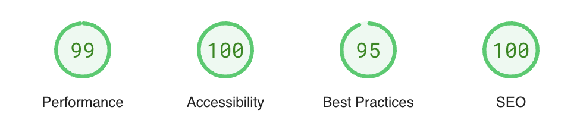

# anirbmuk:profile
**Anirban Mukherjee (anirbmuk) | Staff Frontend Developer | Professional Bio**

## Key features
:heavy_check_mark: Search engine optimized (SEO)  
:heavy_check_mark: SSR enabled  
:heavy_check_mark: Google analytics  
:heavy_check_mark: Dark mode support  

## Lighthouse report  
  

## Technical mumbo-jumbo
| What I wanted | What I got            |
| ------------- | --------------------- |
| IDE           | MS Visual Studio Code |
| Front-end     | Vue / Tailwindcss     |
| SSR & BFF     | Nuxt                  |
| Database      | Google Firestore      |
| Analytics     | G4A / GTM             |

## Quick Start & Documentation
Local development server:
```
yarn dev
https://localhost:3000/en
```

Local SSR run:
```
yarn build && yarn start:env
http://localhost:3000/en
```

Production build and deployment:  
```
yarn deploy  
https://anirbmuk.appspot.com/en  
```

---
## Copyright
(C) anirbmuk, 2025  
